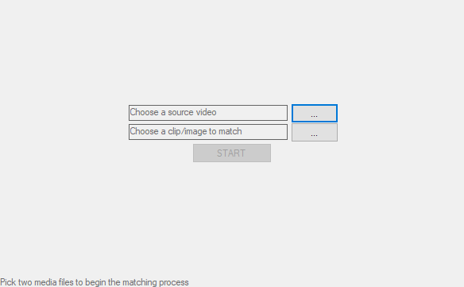

# ScreenCapSeeker
Do you ever wanted to find the exact timestamp in a movie of that one meme image, but didn't want to spend few hours actually watching the movie? **ScreenCapSeeker** can do that for you. Pick a video file and a screenshot from it, and just press START to being the seeking process. Once completed **ScreenCapSeeker** will print out the location of the closest looking frame compared to the provided screenshot. 
  
With my Ryzen 7 2700X **ScreenCapSeeker** processes around 100 frames per second on 720p videos.

# Installation
Simply download and extract *ScreenCapSeeker.zip* from the *Releases* page.  
Note that 64bit Windows and .NET 4.8 are required (as is 64bit FFmpeg but it has been included in the `FFmpeg\bin\x64` directory).

# Usage
Open up *ScreenCapSeeker.exe* and you'll be prompted to browse for two media files. The first one will be the movie we'll be seeking through, and the second one is an image (or a video) to search for. Since **ScreenCapSeeker** uses *FFmpeg* behind the scenes, it can open all popular formats including mp4, mkv, avi, png, jpeg, bmp, and few others.
  
If you select a video instead of a screenshot, an additional window will open prompting for a frame to extract. This a quality-of-life option in case you have a short clip from a full movie, and don't want to spend time extracting a proper screenshot.  
 
When selecting a screenshot try to get as close as possible to the quality of the source video. Watermarks, subtitles or compression artifacts might not pose that big of a problem, but cropping will definitely will. 

##### Results
As the video is being process **ScreenCapSeeker** will show the preview of the current results. Updated every 100 frames.  
  
1. Currently processed frame. 
2. Last processed frame to best match the supplied screenshot.
3. Data used for the comparison operation. In 99% of cases this will be the same frame as #2.
4. Screenshot to look for.
5. You can always abort the search by pressing *CANCEL*.
6. Bottom panel shows the current progress.
  
# Credits
**ScreenCapSeeker** uses [Ruslan-B/FFmpeg.AutoGen](https://github.com/Ruslan-B/FFmpeg.AutoGen) to access the FFmpeg bindings.  
Included FFmpeg binaries were downloaded from [BtbN/FFmpeg-Builds](https://github.com/BtbN/FFmpeg-Builds/releases).

# Disclaimer
I have minimal knowledge about FFmpeg inner workings so can't promise everything will work as expected. Feel free to create an issue if anything goes wrong, and I'll see what I can do.
